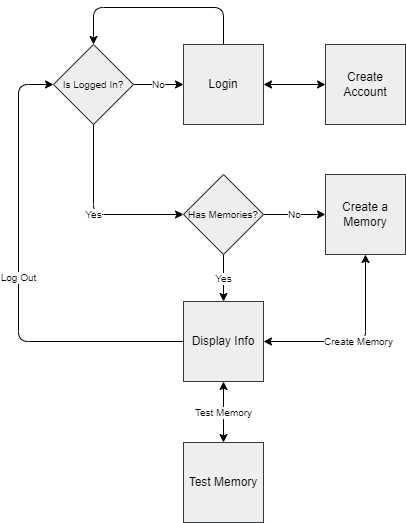
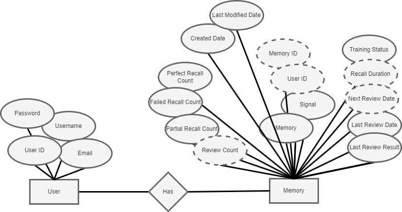

# Memory Bot

The purpose of Memory Bot is to enhance study by helping the user train their memorization. This is done through a series of recall tests that is tracked to build complete memorization.

## Features

- Users start by creating what is they want to remember and a prompt to trigger the memory.
- Users can test their memory given the prompt and try to recall the answer.
- The result of the recall is recorded in the database.
- The data is used to guide the user until they achieve complete synchronization with their memory.

## API

- Standard login/register/logout to manage user account and data.
- Create memory endpoint to create the memory. Prompt and answer must be provided to create the memory.
- Update memory endpoint to make changes.
- Delete memory endpoint to delete memories.
- View all memories endpoint to access memory data.
- View one memory to get specific information.
- Test memory endpoint so that users can test their recall.

## Entity Relationship Diagram

